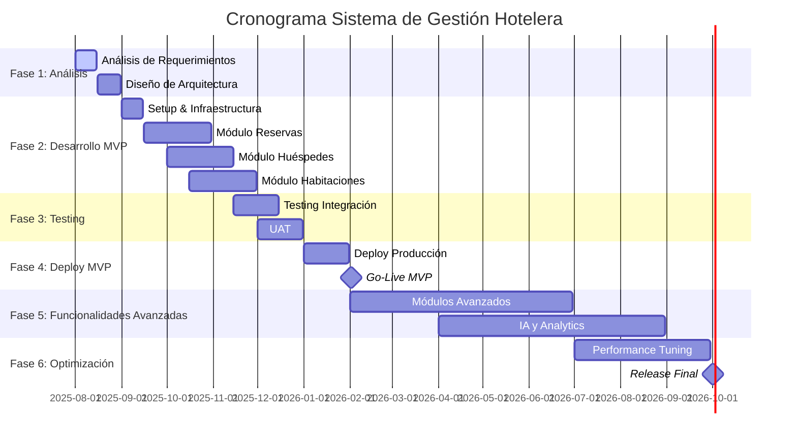

# Cronograma y Fases del Proyecto

## 📅 **Cronograma General del Proyecto**

### **Duración Total: 18 meses (Agosto 2025 - Febrero 2027)**



---

## 🎯 **Fase 1: Análisis y Diseño (2 meses)**

### **Mes 1: Análisis de Requerimientos**

#### **Semana 1-2: Kickoff y Discovery**
| Actividad | Responsable | Entregable | Duración |
|-----------|-------------|------------|----------|
| Project Kickoff | PM | Project Charter | 2 días |
| Stakeholder Interviews | Analista Funcional | Requirements Document | 5 días |
| Current State Analysis | Analista Técnico | AS-IS Process Map | 3 días |
| Competitive Analysis | UX Designer | Market Research Report | 2 días |

#### **Semana 3-4: Definición de Requerimientos**
| Actividad | Responsable | Entregable | Duración |
|-----------|-------------|------------|----------|
| Functional Requirements | Analista Funcional | Functional Spec | 8 días |
| Non-Functional Requirements | Analista Técnico | NFR Document | 5 días |
| User Stories Creation | Analista Funcional | Product Backlog | 3 días |
| Acceptance Criteria | QA Lead | Test Criteria | 2 días |

### **Mes 2: Diseño de Arquitectura**

#### **Semana 5-6: Arquitectura del Sistema**
| Actividad | Responsable | Entregable | Duración |
|-----------|-------------|------------|----------|
| System Architecture Design | Arquitecto Software | Architecture Document | 8 días |
| Database Design | Analista Técnico | Data Model | 5 días |
| API Design | Desarrollador Senior | API Specification | 5 días |
| Security Design | DevOps Engineer | Security Plan | 3 días |

#### **Semana 7-8: UI/UX Design**
| Actividad | Responsable | Entregable | Duración |
|-----------|-------------|------------|----------|
| User Research | UX Designer | User Personas | 3 días |
| Wireframes | UX Designer | Wireframe Set | 5 días |
| UI Mockups | UX Designer | Visual Designs | 8 días |
| Prototype | UX Designer | Interactive Prototype | 3 días |

### **Entregables Fase 1**
- ✅ Business Requirements Document
- ✅ Functional Specifications
- ✅ Technical Architecture Document
- ✅ Database Design Document
- ✅ API Specifications
- ✅ UI/UX Design System
- ✅ Project Plan Detallado
- ✅ Risk Assessment
- ✅ Quality Plan

---

## 💻 **Fase 2: Desarrollo MVP (4 meses)**

### **Sprint Structure: 8 Sprints de 2 semanas cada uno**

#### **Sprint 1-2: Infraestructura y Setup (Mes 3)**

**Sprint 1: Foundation Setup**
| User Story | Story Points | Assignee | Definition of Done |
|------------|--------------|----------|-------------------|
| Setup Azure Infrastructure | 13 | DevOps Engineer | Infrastructure deployed |
| Configure CI/CD Pipelines | 8 | DevOps Engineer | Automated deployment working |
| Setup Development Environment | 5 | Todo el equipo | All developers can run locally |
| Database Schema Creation | 8 | Analista Técnico | Core tables created |

**Sprint 2: Core Framework**
| User Story | Story Points | Assignee | Definition of Done |
|------------|--------------|----------|-------------------|
| Authentication System | 13 | Desarrollador Senior | Login/logout working |
| API Gateway Configuration | 8 | DevOps Engineer | API routing functional |
| Basic UI Framework | 8 | Desarrollador Frontend | Base components available |
| Logging and Monitoring | 5 | DevOps Engineer | Basic telemetry working |

#### **Sprint 3-4: Módulo de Reservas (Mes 4)**

**Sprint 3: Búsqueda y Disponibilidad**
| User Story | Story Points | Assignee | Definition of Done |
|------------|--------------|----------|-------------------|
| Como guest quiero buscar habitaciones disponibles | 13 | Dev Senior #1 | Search API + UI working |
| Como guest quiero ver precios dinámicos | 8 | Dev Senior #1 | Pricing engine basic |
| Como guest quiero filtrar por tipo de habitación | 5 | Dev Junior #1 | Filter functionality |
| Como admin quiero gestionar inventario | 8 | Dev Senior #2 | Inventory management |

**Sprint 4: Creación de Reservas**
| User Story | Story Points | Assignee | Definition of Done |
|------------|--------------|----------|-------------------|
| Como guest quiero crear una reserva | 13 | Dev Senior #1 | End-to-end booking flow |
| Como guest quiero recibir confirmación | 5 | Dev Junior #1 | Email notifications |
| Como staff quiero ver reservas del día | 8 | Dev Senior #2 | Daily reservations view |
| Como guest quiero modificar mi reserva | 8 | Dev Junior #2 | Modification workflow |

#### **Sprint 5-6: Módulo de Huéspedes (Mes 5)**

**Sprint 5: Gestión de Perfiles**
| User Story | Story Points | Assignee | Definition of Done |
|------------|--------------|----------|-------------------|
| Como guest quiero crear mi perfil | 8 | Dev Senior #2 | Guest registration |
| Como guest quiero actualizar mis datos | 5 | Dev Junior #1 | Profile management |
| Como staff quiero buscar huéspedes | 8 | Dev Junior #2 | Guest search functionality |
| Como sistema quiero trackear historial | 13 | Dev Senior #1 | Stay history tracking |

**Sprint 6: Preferencias y Loyalty**
| User Story | Story Points | Assignee | Definition of Done |
|------------|--------------|----------|-------------------|
| Como guest quiero guardar preferencias | 8 | Dev Junior #1 | Preferences system |
| Como guest quiero ver mi loyalty status | 5 | Dev Junior #2 | Loyalty points display |
| Como staff quiero ver guest preferences | 5 | Dev Senior #2 | Staff preference view |
| Como marketing quiero segmentar guests | 13 | Dev Senior #1 | Guest segmentation |

#### **Sprint 7-8: Módulo de Habitaciones (Mes 6)**

**Sprint 7: Gestión de Habitaciones**
| User Story | Story Points | Assignee | Definition of Done |
|------------|--------------|----------|-------------------|
| Como housekeeping quiero ver estado de habitaciones | 8 | Dev Senior #2 | Room status dashboard |
| Como staff quiero asignar habitaciones | 8 | Dev Junior #1 | Room assignment |
| Como maintenance quiero reportar issues | 5 | Dev Junior #2 | Maintenance requests |
| Como manager quiero ver occupancy reports | 13 | Dev Senior #1 | Occupancy analytics |

**Sprint 8: Check-in/Check-out**
| User Story | Story Points | Assignee | Definition of Done |
|------------|--------------|----------|-------------------|
| Como guest quiero hacer check-in | 13 | Dev Senior #1 | Check-in process |
| Como guest quiero hacer check-out | 8 | Dev Senior #2 | Check-out process |
| Como staff quiero procesar check-ins walk-in | 8 | Dev Junior #1 | Walk-in functionality |
| Como guest quiero check-in móvil | 5 | Dev Junior #2 | Mobile check-in basic |

### **Velocity Planning**
```
Equipo Velocity Target: 60 story points por sprint
├── Desarrollador Senior #1: 20 SP
├── Desarrollador Senior #2: 20 SP  
├── Desarrollador Junior #1: 10 SP
└── Desarrollador Junior #2: 10 SP

Sprint Capacity Considerations:
- Holidays/Vacation: -10% velocity
- Learning curve (primeros 2 sprints): -20% velocity
- Technical debt: 20% of sprint capacity
```