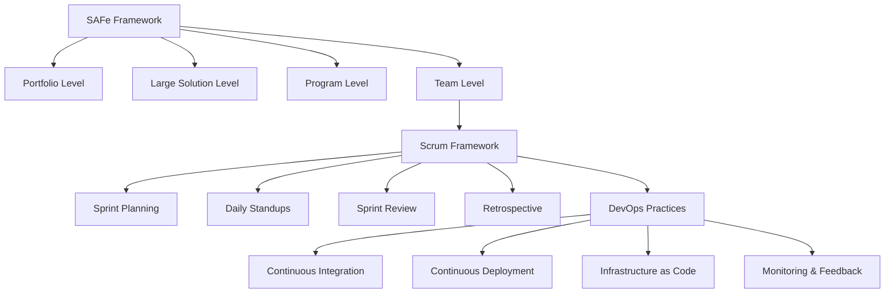
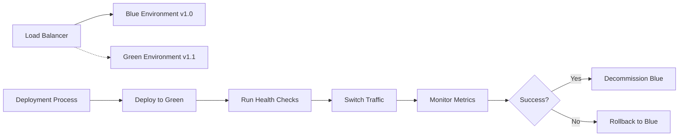

# Metodología de Desarrollo - Sistema de Gestión Hotelera

## 🏗️ **Framework Metodológico Híbrido**

### **Enfoque Adoptado: SAFe + Scrum + DevOps**



### **Justificación del Enfoque Híbrido**

| Framework | Aplicación en el Proyecto | Beneficios |
|-----------|---------------------------|------------|
| **SAFe (Scaled Agile)** | Coordinación entre equipos, gestión de dependencias | Alineación estratégica, gestión de riesgos a gran escala |
| **Scrum** | Desarrollo iterativo de cada microservicio | Entregas frecuentes, adaptabilidad, feedback rápido |
| **DevOps** | Automatización, integración y entrega continua | Time-to-market reducido, calidad mejorada |

---

## 🎯 **SAFe Framework Implementation**

### **Portfolio Epic Structure**

```
Hotel Management System Portfolio
│
├── Epic 1: Core Booking Platform
│   ├── Feature 1.1: Search & Availability Engine
│   ├── Feature 1.2: Reservation Management
│   ├── Feature 1.3: Payment Processing
│   └── Feature 1.4: Confirmation & Notifications
│
├── Epic 2: Guest Experience Platform
│   ├── Feature 2.1: Guest Profile Management
│   ├── Feature 2.2: Loyalty Program
│   ├── Feature 2.3: Mobile Check-in/out
│   └── Feature 2.4: Guest Services Portal
│
├── Epic 3: Operations Management
│   ├── Feature 3.1: Room Management System
│   ├── Feature 3.2: Housekeeping Workflow
│   ├── Feature 3.3: Maintenance Management
│   └── Feature 3.4: Staff Scheduling
│
└── Epic 4: Business Intelligence
    ├── Feature 4.1: Real-time Analytics
    ├── Feature 4.2: Revenue Management
    ├── Feature 4.3: Predictive Analytics
    └── Feature 4.4: Executive Dashboards
```

### **Program Increment (PI) Planning**

#### **PI 1 (Meses 1-3): Foundation & Core Booking**

**Sprint Structure**: 6 sprints de 2 semanas

| Sprint | Objective | Key Features | Success Criteria |
|--------|-----------|--------------|------------------|
| **Sprint 1** | Infrastructure Setup | DevOps pipelines, base architecture | All environments operational |
| **Sprint 2** | Authentication & Core APIs | User management, API gateway | Authentication working E2E |
| **Sprint 3** | Room Inventory Management | Room types, availability engine | Can search available rooms |
| **Sprint 4** | Basic Booking Flow | Create reservation, basic payment | Can complete a booking |
| **Sprint 5** | Guest Management | Guest profiles, history | Guest data properly stored |
| **Sprint 6** | Integration & Testing | E2E testing, performance testing | MVP ready for stakeholder demo |

#### **PI 2 (Meses 4-6): Enhanced Features & Operations**

| Sprint | Objective | Key Features | Success Criteria |
|--------|-----------|--------------|------------------|
| **Sprint 7** | Advanced Booking Features | Group bookings, modifications | Complex scenarios handled |
| **Sprint 8** | Mobile Experience | Responsive design, mobile APIs | Mobile-first experience |
| **Sprint 9** | Operations Tools | Housekeeping, maintenance | Staff can manage operations |
| **Sprint 10** | Payment & Billing | Payment gateway, invoicing | Full payment processing |
| **Sprint 11** | Notifications & Communications | Email, SMS, in-app notifications | Automated communications |
| **Sprint 12** | Analytics Foundation | Basic reporting, dashboards | Key metrics available |

### **Agile Release Train (ART) Structure**

```
Hotel Management ART
│
├── Team 1: Booking Services
│   ├── Product Owner: Business Analyst
│   ├── Scrum Master: Senior Developer
│   ├── Developers: 2 Senior + 1 Junior
│   └── QA: 1 Automation Engineer
│
├── Team 2: Guest Experience
│   ├── Product Owner: UX Designer
│   ├── Scrum Master: Technical Lead
│   ├── Developers: 1 Senior + 2 Junior
│   └── QA: 1 Manual Tester
│
└── Team 3: Platform & DevOps
    ├── Product Owner: Technical Architect
    ├── DevOps Engineer: 1 Senior
    ├── Infrastructure: 1 Cloud Specialist
    └── Security: 1 Security Engineer
```

---

## 🔄 **Scrum Implementation Details**

### **Sprint Ceremonies**

#### **Sprint Planning (4 horas cada 2 semanas)**

**Part 1: What (2 horas)**
- **Participants**: Product Owner, Scrum Master, Development Team
- **Input**: Refined Product Backlog, Team Velocity, Sprint Goal
- **Output**: Sprint Backlog, Sprint Goal Definition

**Part 2: How (2 horas)**
- **Participants**: Scrum Master, Development Team
- **Activities**: Task breakdown, effort estimation, dependency identification
- **Output**: Detailed Sprint Plan, Task assignments

#### **Daily Standup (15 minutos)**

**Format**: 
```
Team Member Updates:
├── What I accomplished yesterday
├── What I plan to do today  
├── Any impediments or blockers
└── Dependencies on other team members

Team Sync:
├── Sprint goal progress check
├── Impediment resolution
└── Quick coordination for the day
```

**Tools**: Microsoft Teams con integración a Azure DevOps

#### **Sprint Review (2 horas)**

**Agenda**:
1. **Demo (60 min)**: Live demonstration of completed features
2. **Feedback Collection (30 min)**: Stakeholder input and questions
3. **Metrics Review (20 min)**: Velocity, quality metrics, burndown
4. **Next Sprint Preview (10 min)**: Upcoming priorities

**Participants**: 
- Scrum Team
- Product Owner
- Key Stakeholders
- Hotel Management Representatives

#### **Sprint Retrospective (1.5 horas)**

**Format - Start/Stop/Continue**:
```
🟢 START (What should we start doing?)
├── New practices or tools
├── Process improvements
└── Team collaboration enhancements

🔴 STOP (What should we stop doing?)
├── Inefficient processes
├── Time-wasting activities
└── Blocking behaviors

🔵 CONTINUE (What should we keep doing?)
├── Successful practices
├── Effective tools
└── Positive team behaviors
```

**Action Items Tracking**: Azure DevOps Work Items with "Improvement" tag

### **Product Backlog Management**

#### **User Story Format**
```
As a [type of user]
I want [some goal]
So that [some reason/benefit]

Acceptance Criteria:
- Given [context]
- When [action]
- Then [outcome]

Definition of Done:
□ Code developed and unit tested
□ Integration tests passing
□ Code review completed
□ Documentation updated
□ Deployed to staging environment
□ Product Owner acceptance
```

#### **Story Point Estimation**

**Modified Fibonacci Scale**: 1, 2, 3, 5, 8, 13, 20, 40, 100

| Points | Complexity | Time Estimate | Examples |
|--------|------------|---------------|----------|
| **1-2** | Trivial | 2-4 hours | UI text changes, config updates |
| **3-5** | Simple | 0.5-1 day | Basic CRUD operations, simple validations |
| **8** | Medium | 2-3 days | Integration with external API, complex UI |
| **13** | Complex | 3-5 days | New module, complex business logic |
| **20+** | Very Complex | 1+ week | Requires breakdown into smaller stories |

#### **Backlog Refinement Process**

**Weekly Refinement Session (1 hora)**
- **Participants**: Product Owner, Scrum Master, 2-3 Developers
- **Activities**:
  1. Review upcoming stories (next 2-3 sprints)
  2. Add missing acceptance criteria
  3. Estimate story points
  4. Identify dependencies
  5. Break down large stories

**Definition of Ready**:
- ✅ Clear user story format
- ✅ Well-defined acceptance criteria
- ✅ Estimated story points
- ✅ Dependencies identified
- ✅ Mockups/wireframes available (if UI story)
- ✅ Technical approach discussed

---

## ⚙️ **DevOps Integration**

### **Continuous Integration Pipeline**

```yaml
# Azure DevOps Pipeline
trigger:
  branches:
    include:
    - main
    - develop
    - feature/*

variables:
  buildConfiguration: 'Release'
  dotNetFramework: 'net6.0'
  dotNetVersion: '6.0.x'

stages:
- stage: CI
  displayName: 'Continuous Integration'
  jobs:
  - job: Build
    displayName: 'Build and Test'
    pool:
      vmImage: 'windows-latest'
    
    steps:
    - task: UseDotNet@2
      inputs:
        version: $(dotNetVersion)
    
    - task: DotNetCoreCLI@2
      displayName: 'Restore packages'
      inputs:
        command: 'restore'
        projects: '**/*.csproj'
    
    - task: SonarCloudPrepare@1
      inputs:
        SonarCloud: 'SonarCloud'
        organization: 'hotelms'
        scannerMode: 'MSBuild'
        projectKey: 'hotel-management-system'
    
    - task: DotNetCoreCLI@2
      displayName: 'Build application'
      inputs:
        command: 'build'
        projects: '**/*.csproj'
        arguments: '--configuration $(buildConfiguration)'
    
    - task: DotNetCoreCLI@2
      displayName: 'Run unit tests'
      inputs:
        command: 'test'
        projects: '**/*Tests/*.csproj'
        arguments: '--configuration $(buildConfiguration) --collect "Code coverage"'
    
    - task: SonarCloudAnalyze@1
    
    - task: SonarCloudPublish@1
      inputs:
        pollingTimeoutSec: '300'
```

### **Quality Gates**

#### **Automated Quality Checks**

| Check Type | Tool | Threshold | Action on Fail |
|------------|------|-----------|----------------|
| **Unit Test Coverage** | dotCover | ≥ 80% | Block deployment |
| **Code Quality** | SonarQube | Grade A | Block deployment |
| **Security Vulnerabilities** | SonarQube | 0 Critical | Block deployment |
| **Performance Tests** | JMeter | < 2s response time | Generate warning |
| **Integration Tests** | SpecFlow | 100% pass | Block deployment |
| **API Contract Tests** | Pact | 100% pass | Block deployment |

#### **Manual Quality Gates**

| Gate | Responsible | Criteria | Timeline |
|------|-------------|----------|----------|
| **Code Review** | Senior Developer | 2 approvals required | Before merge |
| **UX Review** | UX Designer | UI/UX standards compliance | Before staging |
| **Security Review** | Security Engineer | Security checklist completed | Before production |
| **Performance Review** | DevOps Engineer | Load test results acceptable | Before production |

### **Deployment Strategy**

#### **Environment Promotion Pipeline**

```
Developer Workstation
        ↓ (git push)
Feature Branch
        ↓ (Pull Request)
Develop Branch
        ↓ (Automated)
Development Environment
        ↓ (Manual Approval)
Staging Environment  
        ↓ (Manual Approval + Quality Gates)
Production Environment
```

#### **Blue-Green Deployment**



### **Monitoring and Feedback**

#### **Application Performance Monitoring**

**Azure Application Insights Configuration**:
```json
{
  "ApplicationInsights": {
    "InstrumentationKey": "${APPINSIGHTS_KEY}",
    "CloudRoleName": "hotel-management-api",
    "Sampling": {
      "Rate": 10.0
    },
    "CustomMetrics": [
      "BookingCreated",
      "CheckInCompleted",
      "PaymentProcessed"
    ]
  }
}
```

**Key Metrics Tracked**:
- **Business Metrics**: Booking conversion rate, revenue per room
- **Technical Metrics**: Response time, error rate, throughput
- **User Experience**: Page load time, user satisfaction score

#### **Alerting Strategy**

| Alert Type | Threshold | Recipients | Response Time |
|------------|-----------|------------|---------------|
| **Critical System Down** | >5% error rate | DevOps, PM | 15 minutes |
| **High Response Time** | >3s average | Development Team | 30 minutes |
| **Database Issues** | >80% CPU | DBA, DevOps | 15 minutes |
| **Security Incident** | Suspicious activity | Security Team | 5 minutes |

---

## 📊 **Métricas y KPIs**

### **Métricas de Desarrollo (Team Level)**

#### **Velocity Tracking**
```
Sprint Velocity (Story Points)
┌─────────────────────────────────────┐
│  Sprint  │ Planned │ Completed │ % │
├─────────────────────────────────────┤
│    1     │   45    │    42     │93%│
│    2     │   48    │    51     │106%│
│    3     │   50    │    47     │94%│
│    4     │   52    │    55     │106%│
└─────────────────────────────────────┘
Trend: Stabilizing around 50 SP per sprint
Recommendation: Maintain current capacity
```

#### **Quality Metrics**

| Metric | Target | Current | Trend |
|--------|---------|---------|-------|
| **Code Coverage** | >80% | 85% | ↗️ |
| **Defect Density** | <2 per KLOC | 1.5 | ↗️ |
| **Test Automation** | >90% | 88% | ↗️ |
| **Technical Debt Ratio** | <5% | 3.2% | ↗️ |
| **Build Success Rate** | >95% | 97% | ↗️ |

### **Métricas de Proceso (Program Level)**

#### **Delivery Predictability**
```
PI Objectives Achievement
┌─────────────────────────────────────┐
│   PI 1   │ 8/10 objectives met (80%)│
│   PI 2   │ 9/10 objectives met (90%)│
│   PI 3   │ 10/10 objectives met(100%)│
└─────────────────────────────────────┘
Program Predictability Score: 90%
```

#### **Release Frequency & Lead Time**

| Metric | Q1 | Q2 | Q3 | Target |
|--------|----|----|----|---------|
| **Deployment Frequency** | Weekly | 2x/week | Daily | Daily |
| **Lead Time** | 14 days | 10 days | 7 days | <5 days |
| **MTTR** | 4 hours | 2 hours | 1 hour | <1 hour |
| **Change Failure Rate** | 15% | 10% | 5% | <5% |

### **Métricas de Negocio (Portfolio Level)**

#### **Value Delivery**

| Business Metric | Baseline | Current | Target |
|-----------------|----------|---------|--------|
| **Time to Market** | 18 months | 12 months | 10 months |
| **Customer Satisfaction** | N/A | 4.2/5 | 4.5/5 |
| **ROI** | N/A | 120% | 150% |
| **Market Share Growth** | 0% | 2.5% | 5% |

---

## 🔄 **Continuous Improvement**

### **Inspect and Adapt Workshop**

**Quarterly PI Review Process**:

1. **Quantitative Review (30 min)**
   - PI metrics review
   - Velocity and quality trends
   - Business value delivered

2. **Qualitative Review (45 min)**
   - What went well?
   - What could be improved?
   - What did we learn?

3. **Problem-Solving Workshop (60 min)**
   - Root cause analysis
   - Improvement backlog creation
   - Action plan development

4. **Planning Next PI (45 min)**
   - Capacity planning
   - Risk assessment
   - Goal setting

### **Innovation and Planning Iteration**

**Every 5th Sprint (Innovation Sprint)**:
- **Technical Debt Reduction**: 40% of sprint capacity
- **Innovation Projects**: 30% of sprint capacity
- **Learning & Development**: 20% of sprint capacity
- **Process Improvement**: 10% of sprint capacity

### **Lessons Learned Repository**

**Documentation Format**:
```markdown
## Lesson Learned: [Title]
**Date**: [Date]
**Project Phase**: [Phase]
**Category**: [Technical/Process/Communication]

### Situation
[What happened?]

### Impact
[What was the result?]

### Root Cause
[Why did it happen?]

### Action Taken
[How was it resolved?]

### Prevention Strategy
[How to prevent in future?]

### Knowledge Sharing
[How was this shared with team?]
```

**Knowledge Management**:
- Monthly knowledge sharing sessions
- Confluence knowledge base
- Cross-team collaboration workshops
- External conference participation