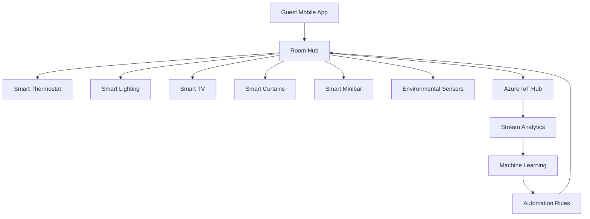
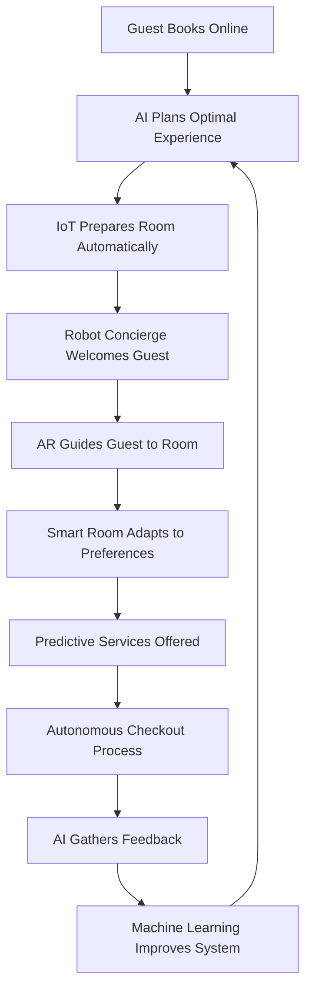

# Propuestas de Innovación - Sistema de Gestión Hotelera

## 🚀 **Visión de Innovación**

> *"Transformar la experiencia hotelera mediante tecnologías emergentes que anticipen las necesidades del huésped y optimicen las operaciones del hotel en tiempo real."*

### **Principios de Innovación**
- 🎯 **Guest-Centric**: Toda innovación debe mejorar la experiencia del huésped
- 🤖 **AI-First**: Incorporar inteligencia artificial en cada proceso
- 📱 **Mobile-Native**: Priorizar la experiencia móvil
- 🌍 **Sustainability**: Promover prácticas sostenibles
- 🔒 **Privacy-by-Design**: Protección de datos desde el diseño

---

## 🧠 **Inteligencia Artificial y Machine Learning**

### **1. Sistema de Recomendaciones Inteligentes**

#### **Propuesta**
Implementar un motor de recomendaciones basado en ML que personalice la experiencia de cada huésped.

#### **Características Técnicas**
```python
# Recommendation Engine Architecture
class GuestRecommendationEngine:
    def __init__(self):
        self.collaborative_filter = CollaborativeFiltering()
        self.content_filter = ContentBasedFiltering()
        self.deep_learning_model = DeepRecommendationNet()
        self.real_time_processor = StreamProcessor()
    
    def generate_recommendations(self, guest_id, context):
        # Hybrid approach combining multiple algorithms
        cf_recs = self.collaborative_filter.predict(guest_id)
        cb_recs = self.content_filter.predict(guest_id, context)
        dl_recs = self.deep_learning_model.predict(guest_id, context)
        
        return self.ensemble_recommendations(
            cf_recs, cb_recs, dl_recs
        )
```

#### **Casos de Uso**
- **Room Recommendations**: Sugerir tipos de habitación basado en preferencias previas
- **Service Recommendations**: Recomendar servicios del hotel (spa, restaurantes)
- **Local Experiences**: Sugerir actividades locales personalizadas
- **Dining Preferences**: Recomendar opciones gastronómicas

#### **Beneficios Esperados**
- 📈 **Revenue Impact**: +15% en servicios adicionales
- 😊 **Guest Satisfaction**: +20% en ratings de experiencia
- 🎯 **Personalization**: 90% de precisión en recomendaciones

### **2. Chatbot Conversacional Avanzado**

#### **Propuesta**
Desarrollar un asistente virtual multilingüe con capacidades de procesamiento de lenguaje natural.

#### **Arquitectura GPT-4 Integration**
```typescript
interface HotelChatbot {
  // Core NLP capabilities
  processNaturalLanguage(message: string, language: string): Intent;
  
  // Booking capabilities
  handleBookingInquiry(inquiry: BookingInquiry): BookingResponse;
  
  // Concierge services
  provideConciergeService(request: ConciergeRequest): ServiceResponse;
  
  // Multi-channel support
  deployToChannel(channel: 'web' | 'whatsapp' | 'telegram'): void;
}

class SmartHotelAssistant implements HotelChatbot {
  private gptModel: GPT4Model;
  private hotelKnowledgeBase: KnowledgeBase;
  private bookingSystem: BookingSystemAPI;
  
  async processRequest(userMessage: string): Promise<Response> {
    const intent = await this.gptModel.classifyIntent(userMessage);
    const context = await this.hotelKnowledgeBase.getContext(intent);
    
    switch(intent.type) {
      case 'BOOKING':
        return this.handleBooking(intent, context);
      case 'INFORMATION':
        return this.provideInformation(intent, context);
      case 'COMPLAINT':
        return this.handleComplaint(intent, context);
      default:
        return this.generateGPTResponse(userMessage, context);
    }
  }
}
```

#### **Capacidades Avanzadas**
- **Multilenguaje**: Soporte para 10+ idiomas con traducción automática
- **Voz a Texto**: Integración con Azure Speech Services
- **Contextual Memory**: Recordar conversaciones previas del huésped
- **Escalation Inteligente**: Transferir a agente humano cuando sea necesario

### **3. Predicción de Demanda con IA**

#### **Propuesta**
Sistema de forecasting que prediga la demanda y optimice precios dinámicamente.

#### **Modelo de Machine Learning**
```python
import tensorflow as tf
from sklearn.ensemble import RandomForestRegressor
import pandas as pd

class DemandForecastingModel:
    def __init__(self):
        self.lstm_model = self.build_lstm_model()
        self.external_factors_model = RandomForestRegressor()
        self.price_optimization_engine = PriceOptimizer()
    
    def build_lstm_model(self):
        model = tf.keras.Sequential([
            tf.keras.layers.LSTM(50, return_sequences=True),
            tf.keras.layers.Dropout(0.2),
            tf.keras.layers.LSTM(50, return_sequences=False),
            tf.keras.layers.Dropout(0.2),
            tf.keras.layers.Dense(1)
        ])
        model.compile(optimizer='adam', loss='mse')
        return model
    
    def predict_demand(self, date_range, external_factors):
        # Combine historical data with external factors
        historical_prediction = self.lstm_model.predict(date_range)
        external_impact = self.external_factors_model.predict(external_factors)
        
        return self.ensemble_prediction(historical_prediction, external_impact)
    
    def optimize_pricing(self, demand_forecast, competitor_prices):
        return self.price_optimization_engine.calculate_optimal_price(
            demand=demand_forecast,
            competitors=competitor_prices,
            capacity=self.hotel_capacity
        )
```

#### **Factores de Predicción**
- **Datos Históricos**: Patrones de ocupación de 5+ años
- **Eventos Locales**: Conciertos, conferencias, festivales
- **Datos Climáticos**: Predicciones meteorológicas
- **Competencia**: Precios y disponibilidad de competidores
- **Tendencias Web**: Búsquedas y menciones en redes sociales

---

## 🌐 **Internet of Things (IoT) y Smart Rooms**

### **4. Habitaciones Inteligentes**

#### **Propuesta**
Transformar las habitaciones en espacios inteligentes que se adapten automáticamente a las preferencias del huésped.

#### **Arquitectura IoT**


#### **Dispositivos y Funcionalidades**

| Dispositivo | Funcionalidad | Tecnología | ROI Esperado |
|-------------|---------------|------------|-------------|
| **Smart Thermostat** | Control automático de temperatura | Zigbee/WiFi | 15% ahorro energético |
| **Smart Lighting** | Iluminación adaptativa según hora | Philips Hue | 20% ahorro energético |
| **Voice Assistant** | Control por voz multilingüe | Amazon Alexa for Hospitality | +25% guest satisfaction |
| **Smart Mirror** | Información personalizada | Raspberry Pi + Display | +30% upselling |
| **Occupancy Sensors** | Detección de presencia | PIR/Radar | 10% ahorro operativo |
| **Smart Safe** | Acceso biométrico | Bluetooth + Biometric | +40% security rating |

#### **Guest Experience Scenarios**

**Scenario 1: Arrival Experience**
```typescript
interface ArrivalExperience {
  async onGuestArrival(guestId: string): Promise<void> {
    const preferences = await this.getGuestPreferences(guestId);
    
    // Auto-configure room
    await this.setTemperature(preferences.temperature);
    await this.setLighting(preferences.lightingMood);
    await this.setTV(preferences.favoriteChannels);
    
    // Welcome message
    await this.displayWelcomeMessage(preferences.language);
    
    // Suggest services
    await this.suggestServices(preferences.interests);
  }
}
```

### **5. Gestión Energética Inteligente**

#### **Propuesta**
Sistema de gestión energética que optimice el consumo en tiempo real usando IA.

#### **Smart Energy Management**
```python
class SmartEnergyManager:
    def __init__(self):
        self.occupancy_predictor = OccupancyPredictor()
        self.weather_integrator = WeatherAPI()
        self.utility_optimizer = UtilityOptimizer()
        self.iot_controller = IoTDeviceController()
    
    async def optimize_energy_consumption(self):
        # Get real-time data
        occupancy_forecast = await self.occupancy_predictor.predict_next_24h()
        weather_data = await self.weather_integrator.get_forecast()
        energy_prices = await self.utility_optimizer.get_current_rates()
        
        # Calculate optimal settings
        optimal_settings = self.calculate_optimal_energy_settings(
            occupancy_forecast, weather_data, energy_prices
        )
        
        # Apply settings to IoT devices
        await self.iot_controller.apply_settings(optimal_settings)
        
        return {
            'estimated_savings': optimal_settings.estimated_savings,
            'comfort_score': optimal_settings.comfort_impact,
            'environmental_impact': optimal_settings.carbon_reduction
        }
```

#### **Beneficios Sostenibles**
- 🌱 **Reducción CO2**: -30% en emisiones de carbono
- 💡 **Ahorro Energético**: -25% en costos de energía
- 🏆 **Certificaciones**: LEED, Green Globe compliance
- 📊 **Transparency**: Reportes de sostenibilidad para huéspedes

---

## 📱 **Experiencia Móvil Innovadora**

### **6. App Móvil con Realidad Aumentada**

#### **Propuesta**
Aplicación móvil que use AR para mejorar la navegación y experiencia en el hotel.

#### **AR Features Implementation**
```swift
// iOS ARKit Implementation
import ARKit
import SceneKit

class HotelARExperience: UIViewController, ARSCNViewDelegate {
    @IBOutlet var sceneView: ARSCNView!
    
    override func viewDidLoad() {
        super.viewDidLoad()
        sceneView.delegate = self
        
        // Initialize AR features
        setupARNavigation()
        setupARServiceMenu()
        setupARTranslation()
    }
    
    func setupARNavigation() {
        // AR wayfinding to hotel amenities
        let configuration = ARWorldTrackingConfiguration()
        configuration.planeDetection = [.horizontal, .vertical]
        sceneView.session.run(configuration)
    }
    
    func renderer(_ renderer: SCNSceneRenderer, didAdd node: SCNNode, for anchor: ARAnchor) {
        // Place AR navigation arrows
        if let planeAnchor = anchor as? ARPlaneAnchor {
            let navigationNode = createNavigationNode(for: planeAnchor)
            node.addChildNode(navigationNode)
        }
    }
}
```

#### **AR Use Cases**
- **Navigation**: Arrows flotantes para llegar a restaurantes, spa, gym
- **Menu Translation**: Traducción instantánea de menús en tiempo real
- **Room Service**: Visualizar platos antes de ordenar
- **Local Attractions**: Información sobre lugares cercanos
- **Virtual Concierge**: Avatar AR para asistencia personalizada

### **7. Blockchain para Loyalty Program**

#### **Propuesta**
Programa de lealtad basado en blockchain con tokens intercambiables.

#### **Smart Contract Architecture**
```solidity
// Solidity Smart Contract
pragma solidity ^0.8.0;

contract HotelLoyaltyToken {
    string public name = "Hotel Loyalty Token";
    string public symbol = "HLT";
    uint8 public decimals = 18;
    
    mapping(address => uint256) public balanceOf;
    mapping(address => mapping(string => uint256)) public stayHistory;
    
    event TokensEarned(address guest, uint256 amount, string hotelId);
    event TokensRedeemed(address guest, uint256 amount, string service);
    
    function earnTokens(
        address guest, 
        uint256 amount, 
        string memory hotelId
    ) public {
        balanceOf[guest] += amount;
        stayHistory[guest][hotelId] += amount;
        emit TokensEarned(guest, amount, hotelId);
    }
    
    function redeemTokens(
        address guest, 
        uint256 amount, 
        string memory service
    ) public {
        require(balanceOf[guest] >= amount, "Insufficient tokens");
        balanceOf[guest] -= amount;
        emit TokensRedeemed(guest, amount, service);
    }
    
    function getGuestTier(address guest) public view returns (string memory) {
        uint256 totalTokens = balanceOf[guest];
        
        if (totalTokens >= 10000) return "Diamond";
        if (totalTokens >= 5000) return "Platinum";
        if (totalTokens >= 2000) return "Gold";
        if (totalTokens >= 500) return "Silver";
        return "Bronze";
    }
}
```

#### **Beneficios del Blockchain Loyalty**
- 🔗 **Interoperabilidad**: Tokens usables en múltiples hoteles de la cadena
- 🔒 **Transparencia**: Historial inmutable de puntos y canjes
- 💱 **Liquidez**: Posibilidad de intercambiar tokens con otros huéspedes
- 🌍 **Global**: Programa unificado a nivel mundial

---

## 🔮 **Tecnologías Emergentes**

### **8. Metaverso y Experiencias Virtuales**

#### **Propuesta**
Crear experiencias virtuales que permitan a los huéspedes "visitar" el hotel antes de reservar.

#### **Virtual Hotel Experience**
```typescript
// Unity/WebGL Implementation
interface MetaverseHotelTour {
  initializeVirtualTour(): Promise<VirtualEnvironment>;
  
  // Room preview in VR/AR
  previewRoom(roomType: string): Promise<VirtualRoom>;
  
  // Virtual concierge
  interactWithAvatarConcierge(): Promise<ConversationSession>;
  
  // Book directly from VR
  bookFromVirtualTour(roomSelection: RoomSelection): Promise<BookingConfirmation>;
}

class MetaverseHotelExperience implements MetaverseHotelTour {
  private unityEngine: UnityWebGL;
  private avatarSystem: AvatarManagement;
  private realTimeSync: RealtimeDataSync;
  
  async initializeVirtualTour(): Promise<VirtualEnvironment> {
    // Load 3D hotel model
    const hotelModel = await this.unityEngine.loadHotelModel();
    
    // Sync with real-time availability
    const availability = await this.realTimeSync.getRoomAvailability();
    
    // Create interactive environment
    return new VirtualEnvironment(hotelModel, availability);
  }
}
```

### **9. Quantum Computing para Optimización**

#### **Propuesta Futurista**
Explorar quantum computing para optimización compleja de operaciones hoteleras.

#### **Quantum Optimization Problems**
```python
# Conceptual Quantum Implementation
from qiskit import QuantumCircuit, Aer, execute
from qiskit.optimization import QuadraticProgram

class QuantumHotelOptimizer:
    def __init__(self):
        self.quantum_backend = Aer.get_backend('qasm_simulator')
        self.classical_fallback = ClassicalOptimizer()
    
    def optimize_room_allocation(self, guest_preferences, room_inventory):
        # Quantum algorithm for complex optimization
        # Problem: Assign rooms to maximize guest satisfaction
        # while minimizing operational costs
        
        problem = QuadraticProgram()
        
        # Add variables (guest-room assignments)
        for guest_id in guest_preferences:
            for room_id in room_inventory:
                problem.binary_var(f'assign_{guest_id}_{room_id}')
        
        # Objective: Maximize satisfaction - Minimize costs
        problem.maximize(self.calculate_satisfaction_function())
        
        # Constraints: One room per guest, room availability
        self.add_quantum_constraints(problem)
        
        # Solve using quantum annealing
        result = self.solve_quantum_problem(problem)
        
        return result if result.feasible else self.classical_fallback.solve(problem)
```

---

## 📊 **Implementación y Roadmap**

### **Fases de Implementación**

#### **Fase 1: Fundación IA (Meses 1-6)**
- ✅ Chatbot básico con NLP
- ✅ Sistema de recomendaciones MVP
- ✅ Predicción de demanda básica
- 💰 **Inversión**: $150K
- 📈 **ROI Esperado**: 110% en 12 meses

#### **Fase 2: IoT y Smart Rooms (Meses 7-12)**
- ✅ 20% de habitaciones convertidas a smart rooms
- ✅ Sistema de gestión energética
- ✅ Sensores de ocupación y ambiente
- 💰 **Inversión**: $300K
- 📈 **ROI Esperado**: 130% en 18 meses

#### **Fase 3: Experiencias Avanzadas (Meses 13-18)**
- ✅ App móvil con AR
- ✅ Blockchain loyalty program
- ✅ Metaverso hotel tours
- 💰 **Inversión**: $200K
- 📈 **ROI Esperado**: 140% en 24 meses

### **Investment vs Return Analysis**

```
Innovation Investment Overview
┌─────────────────────────────────────────────────────┐
│ Technology          │ Investment │ Annual ROI │ Risk │
├─────────────────────────────────────────────────────┤
│ AI Recommendations  │ $50K       │ 180%       │ Low  │
│ Smart Chatbot       │ $75K       │ 150%       │ Low  │
│ IoT Smart Rooms     │ $250K      │ 140%       │ Med  │
│ AR Mobile App       │ $100K      │ 120%       │ Med  │
│ Blockchain Loyalty  │ $80K       │ 110%       │ High │
│ Quantum Computing   │ $500K      │ 200%*      │ High │
└─────────────────────────────────────────────────────┘
* Projected for 2027+
```

### **Success Metrics**

#### **Guest Experience KPIs**
- 📊 **NPS Score**: Target +50 points
- ⭐ **Review Ratings**: Target 4.8/5.0
- 🔄 **Return Guest Rate**: Target +30%
- 💰 **Revenue per Guest**: Target +25%

#### **Operational KPIs**
- ⚡ **Energy Efficiency**: Target -30% consumption
- 🤖 **Automation Rate**: Target 70% of processes
- 📱 **Mobile Adoption**: Target 90% of guests
- 🔧 **Operational Costs**: Target -20% reduction

#### **Innovation KPIs**
- 🚀 **Time to Market**: Target <6 months per feature
- 🏆 **Industry Recognition**: Target 5+ awards annually
- 🔬 **R&D Investment**: 10% of revenue
- 👥 **Staff Innovation**: 100% team participation

---

## 🌟 **Visión Futura: Hotel Autonómico 2030**

### **El Hotel que se Gestiona Solo**



**Características del Hotel Autonómico**:
- 🤖 **90% Operaciones Automatizadas**
- 🧠 **IA Predictiva en Tiempo Real**
- 🌱 **Carbono Neutro Certificado**
- 🔮 **Experiencias Inmersivas AR/VR**
- 🛡️ **Seguridad Biométrica Avanzada**

### **Legacy Innovation Program**

**Commitment to Continuous Innovation**:
- 📚 **Innovation Lab**: Espacio dedicado para experimentación
- 🎓 **University Partnerships**: Colaboración con centros de investigación
- 💡 **Employee Innovation Program**: 20% tiempo para proyectos personales
- 🌐 **Open Innovation Platform**: Colaboración con startups
- 🏆 **Annual Innovation Awards**: Reconocimiento a la creatividad

> *"El futuro de la hospitalidad no es solo sobre tecnología, es sobre crear conexiones humanas más profundas a través de la innovación inteligente."*